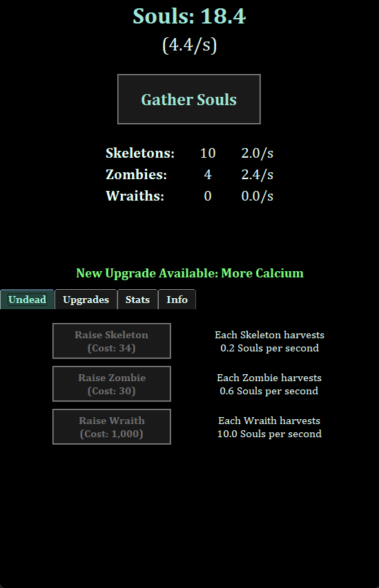
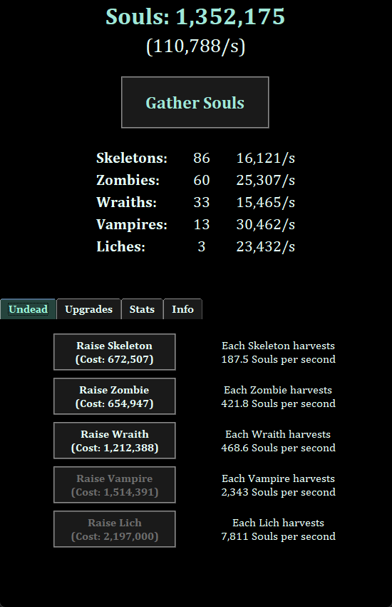
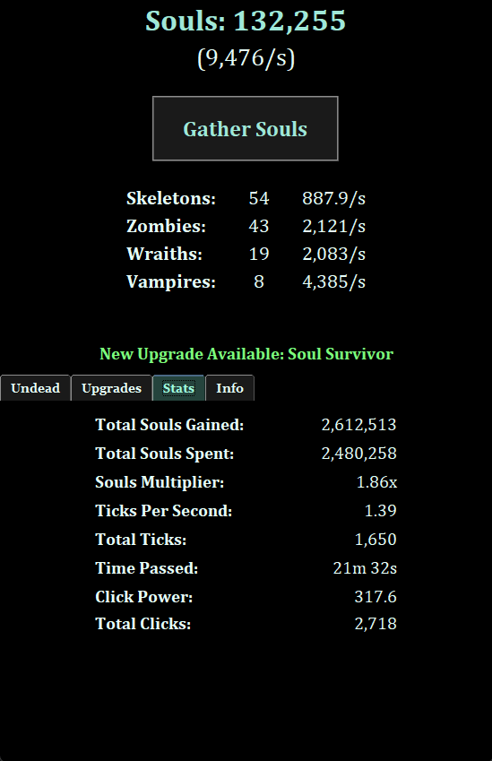
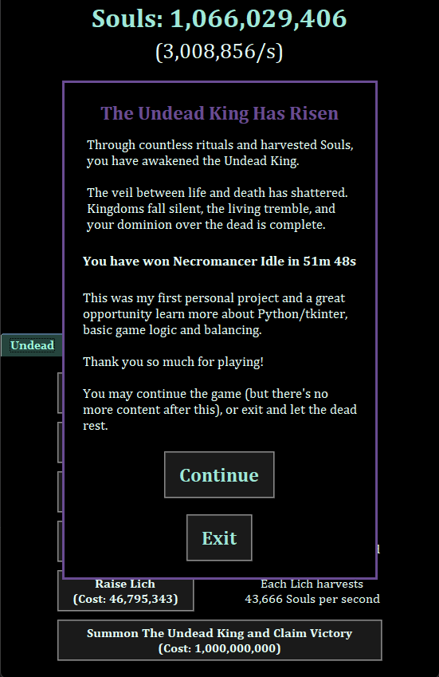

# Necromancer Idle

A short dark-fantasy incremental game built in Python and Tkinter.

Raise undead servants, harvest Souls, unlock upgrades, accelerate your necromantic engine, and ultimately summon the Undead King.

**Necromancer Idle** was my first personal project, used as a first steps in Python project management, simple visual UI creation and game design/balancing.

---

## Installation / Running The Game

### 1. Install Python

Install Python 3.10+ (or newer) if you do not already have it:

https://www.python.org/downloads/

During installation on Windows, make sure to check:

```text
Add Python to PATH
```

---

### 2. Clone This Repository

Open a terminal and run:

```bash
git clone https://github.com/Stone-keep/necromancer_idle.git
cd necromancer_idle
```

Or download the ZIP from GitHub and extract it.

---

### 3. Run The Game

From inside the project folder:

```bash
python main.py
```

On some systems you may need:

```bash
python3 main.py
```

---

### Tkinter Note (Linux)

Tkinter is included with many Python installs, but if it's missing on Debian/Ubuntu:

```bash
sudo apt install python3-tk
```

---

## Download

You can also download a Windows .exe file pre-built using PyInstaller here:

[**Download Necromancer Idle**](https://github.com/Stone-keep/necromancer_idle/releases/tag/v1.0)

## Gameplay

### Early Game

- Click **Gather Souls** to generate your first Souls.
- Buy Skeletons and Zombies to begin passive production.
- Unlock your first upgrades to increase production or reduce undead cost.
- Upgrades are unlocked by specific triggers, e.g. owning 10 of a certain undead, clicking X times or spending Y Souls. Experiment with the mechanics to unlock them.
- Save Souls for Wraiths (sometimes it's worth waiting for a bigger purchase instead of buying a few lower tier undead)

### Mid / Late Game

- Keep buying upgrades to progress.
- Unlock new undead Tier - Vampires (unlocked by raising 10 Wraiths).
- Keep an eye out for upgrades that reduce cost scaling of undead or increase global multiplier depending on how many you own (they might not be very strong right away, but they scale very well into the late game)
- Tick-rate upgrades make the entire game run faster, and also affect upgrades that scale with the number of ticks.
- Unlock the last "normal" undead tier - Liches (unlocked by raising 10 Vampires).
- After certain upgrades, Liches will also raise other undead by themselves, those should be a big priority since they make Liches the most powerful undead by far.

### Win Condition

Reach the conditions to unlock the **Undead King**, summon him for 1,000,000,000 Souls, and claim victory.

The game should be completable in about 50-80 minutes, depending on how active your playstyle is. As usual with "clicker" games, the more you click, the faster you progress.

### Or Just "Cheat"

If you don't feel like spending an hour to go through the whole game, but you would still like to test it, you can definitely do it. 

The save file is a simple .JSON file that you can edit yourself. You just need to launch the game once so it's automatically created, then you can adjust any variables you want. I recommend adding 10,000,000 Souls to your account, setting tick_count to 1000 and click_count to 4500 (those will unlock some upgrades you want to have). That will let you glide through the early/mid game.

## About the Project

My initial goal was to create a very short idle game (completable in 15-20 minutes) in about 20-30 hours. But I kept adding new undead tiers, new upgrades, new mechanics, and it kind of spiraled from there. The whole project took me about 50 hours to complete, and I had to stop myself from adding new features.

Since this was my first non-guided project, I felt really lost at the start, with no idea where to begin. But after spending an hour or two on Google to figure out how to create a simple UI in Tkinter (literally a window with a couple of buttons and some text) and adding the very basic gameplay loop, everything started to click (HA, get it?) into place. After passing those early roadblocks, the project became very fun.

The code is pretty messy and if I started from the scratch, I would do many things differently. But I guess that's what made the project a really good lesson.

---

## What I Learned From This Project

### Python

- How to start a project from scratch without getting overwhelmed.
- Organizing a project across multiple modules - I split parts of the code into a new module a few times during the project.
- Basic use of classes.
- How to make basic game systems out of functions.
- Import structure and separating concerns (avoiding import loops).
- Debugging and refactoring code.

### Tkinter / UI

- How to create frames, button, labels.
- Placing them using `.pack()` and `.grid()` methods.
- Generating new buttons/labels dynamically based on game conditions.
- Styling widgets.
- Managing loops with `after()`
- Using `Toplevel` for modal windows.

### Game Systems / Design

- Designing a simple incremental game loop.
- Creating an upgrade system.
- Tick-rate based simulation.
- Economy balancing and scaling curves.
- Conditinal unlocks.
- Notification system for better informing the player.

### Save/Load System

- Saving game state in JSON.
- Managing the save file and handling exceptions.
- Loading game state back into dictionaries, variables and classes.
- Auto-save and shutdown handling.

---

## Screenshots

### Early Game:



### Late Game:



### Stats Tab:



### Victory Screen:


